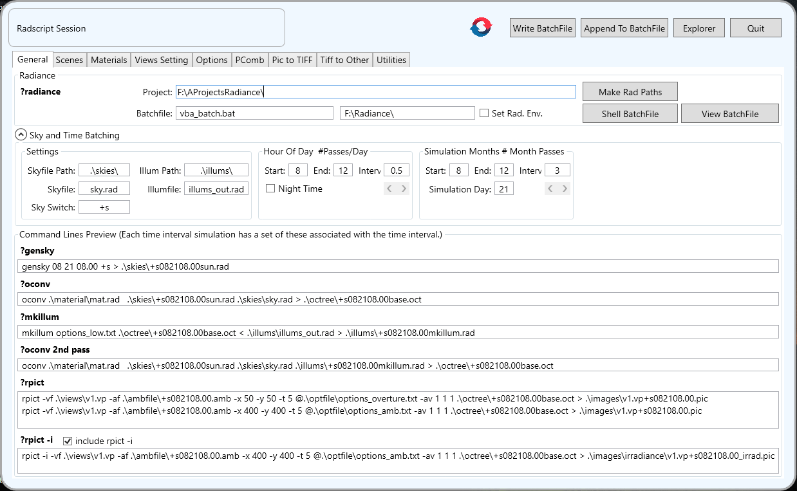
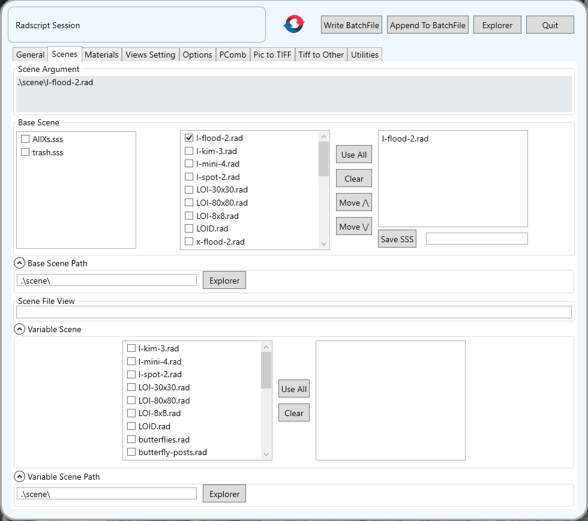
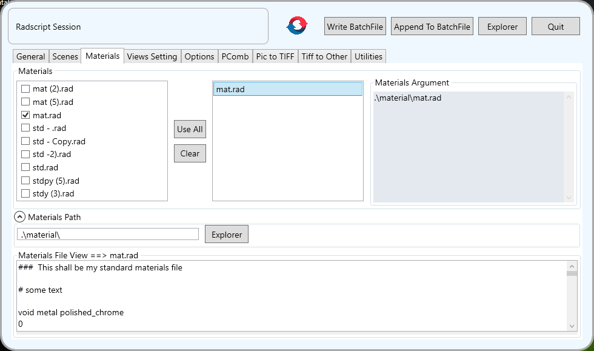
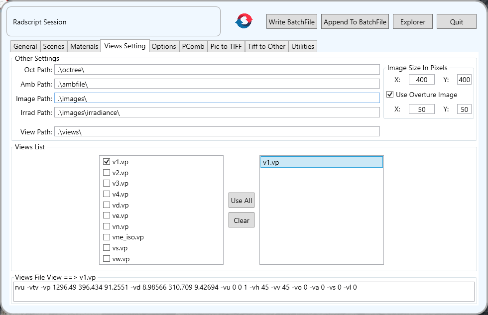
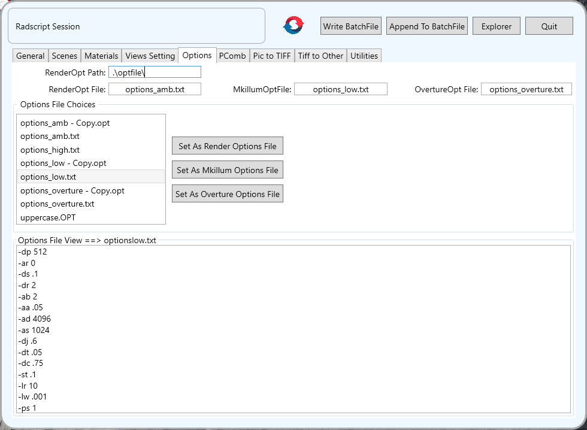
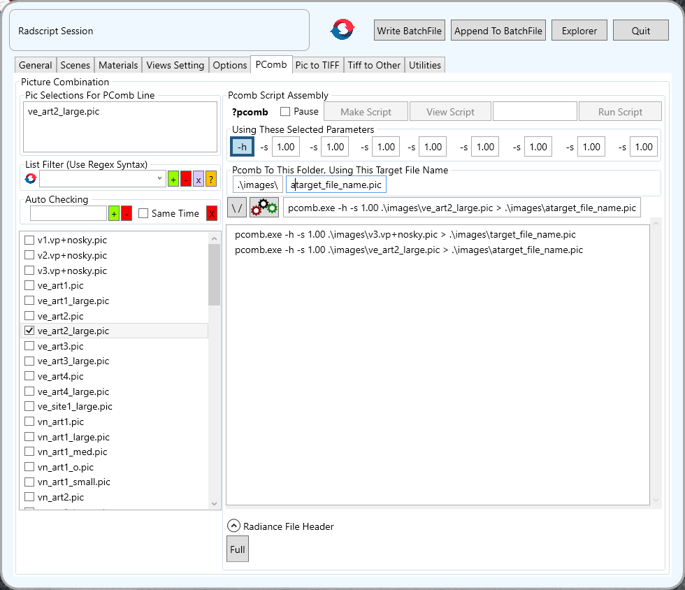
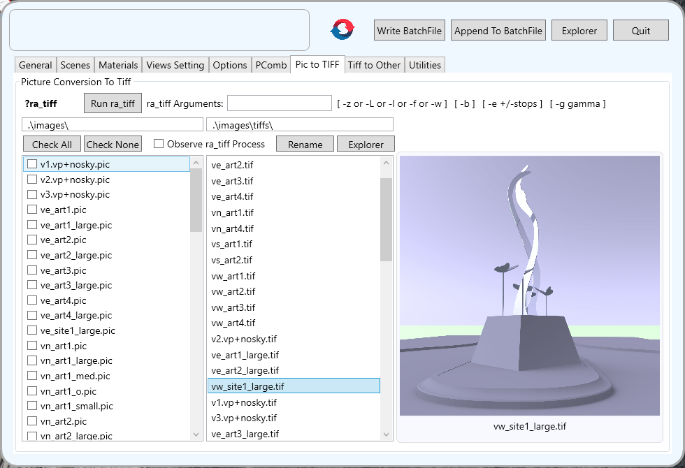
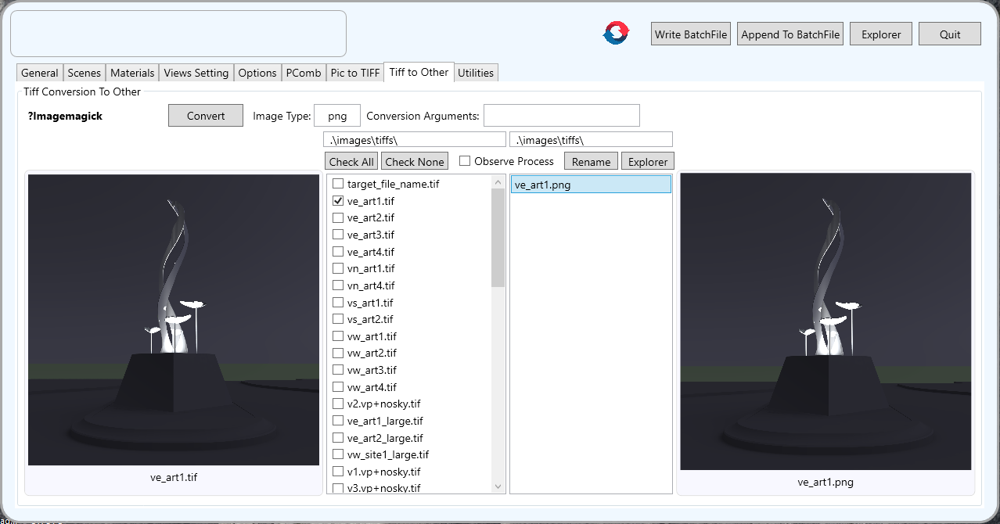
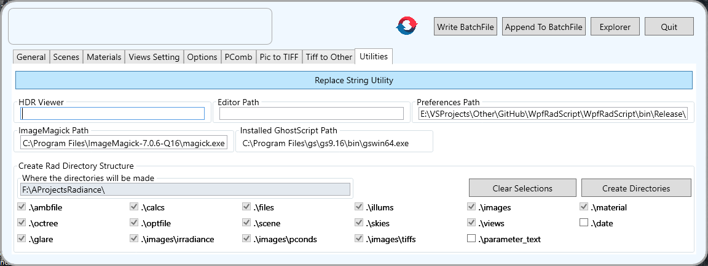

# WpfRadScript  
A WPF front end for various common workflow tasks associated with using the **Radiance Synthetic Imaging System** ([http://radsite.lbl.gov/radiance/][a4d8a80e]) ([https://www.radiance-online.org/][d13f1279]). The **Radiance** system is what is used to make accurate lighting level predictions.

  [a4d8a80e]: http://radsite.lbl.gov/radiance/ "http://radsite.lbl.gov/radiance/"
  [d13f1279]: https://www.radiance-online.org/ "https://www.radiance-online.org/"

  This is a complex application for a very complex suite of **Radiance** utilities. No attempt here is made to explain this WpfRadScript program. Only those familiar with running a **Radiance** system at a nuts and bolts level would recognize what is going on and might find WpfRadScript useful for what is does.

  ### Requirements
  - Radiance installed ([http://radsite.lbl.gov/radiance/][a4d8a80e]) and WpfRadScript told where to find the **Radiance** binaries.
  - The various project definition files needed to setup the lighting simulation.
  - ImageMagick and GhostScript installed. These are used for the final image creation steps in the workflow this application automates.

### Screen Shots

In this workflow Scenes, Materials, Views tab and Options are choreographed in a batch file to generate special simulated HDR images. The **General** tab is the main control point.

The various **Radiance** command lines that will be written to the batch file are shown. Bold text like **?gensky** open the **Radiance** online manual for that command when doubleclicked.  
#### General Tab

The **Scenes** tab is where the scenes argument is built. The arguments shown are transferred to the **General** tab.

#### Scenes Tab

The **Materials** tab is where the materials argument is built. The arguments shown are transferred to the **General** tab.

#### Materials Tab

The **View Setting** tab is where the views are selected. The selections show up in the **General** tab command lines.

#### Views Setting Tab

The **Options** tab is where the options files are selected.

#### Options Tab

The **Radiance** results for running the batch file are **Radiance** PIC image files. These are components to the final result. The **Radiance PComb** function combines **Radiance** PIC image files into another **Radiance** PIC file using parameters for each component that controls how it is combined into the final result. The **PComb** tab is where this happens.

#### PComb Tab

The final **Radiance** PIC image files, which are special files that have significant technical data use within **Radiance**, must be converted to standard image formats when intended for presentation viewing. The first conversion is from PIC to Tiff. The **Pic to Tiff** tab is where this happens.

#### Pic to Tiff Tab

Once the images are converted to TIFF files then can then be converted to more useful image formats. The **Tiff to Other** tab is where this happens. At this step ImageMagick makes the conversion and can be used in its full capability.

#### Tiff to Other Tab

#### Utilities Tab

